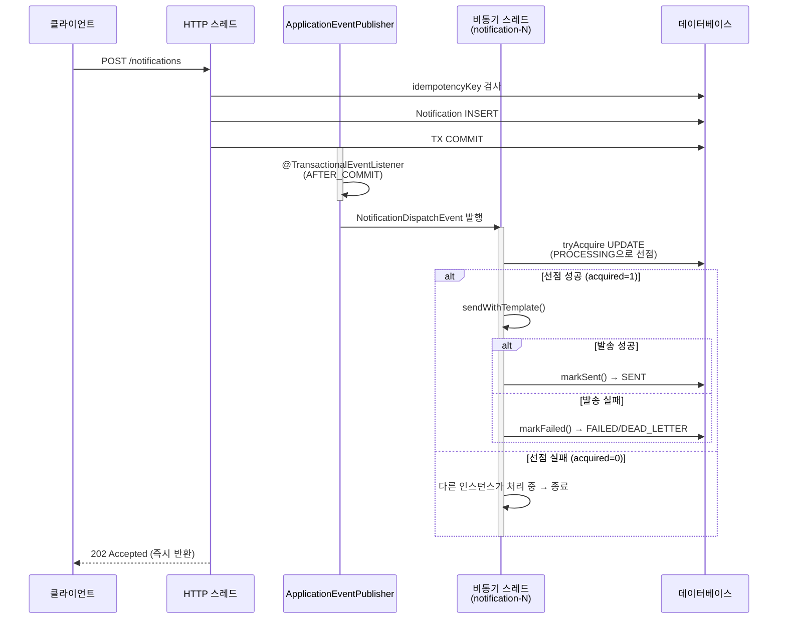
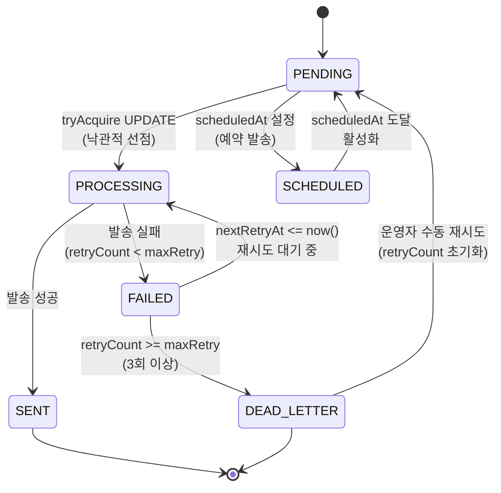
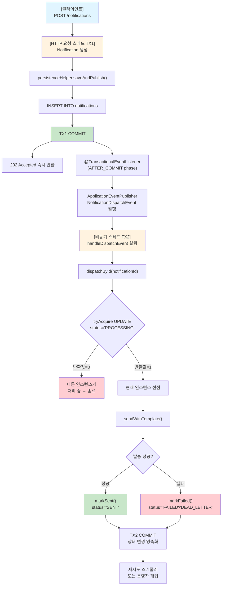
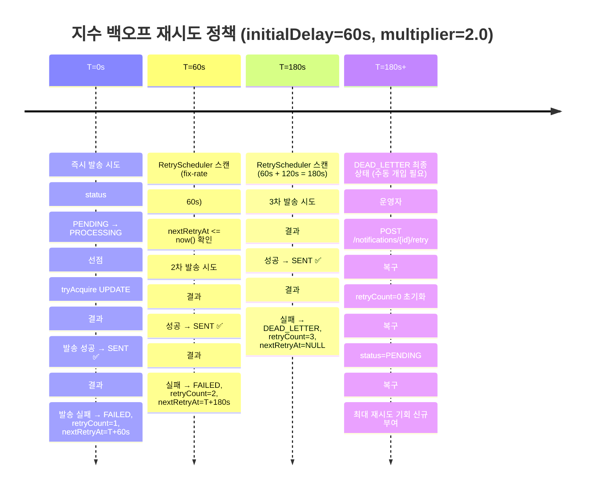
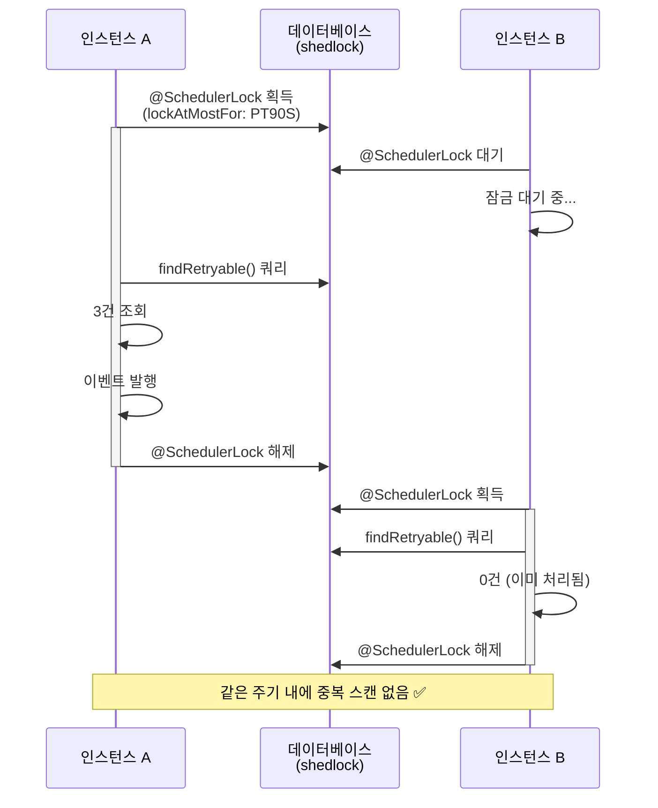
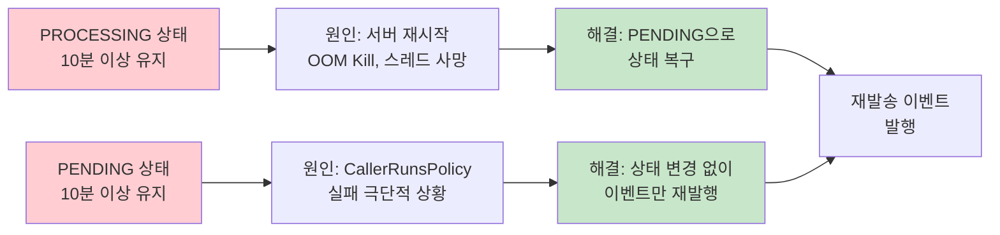
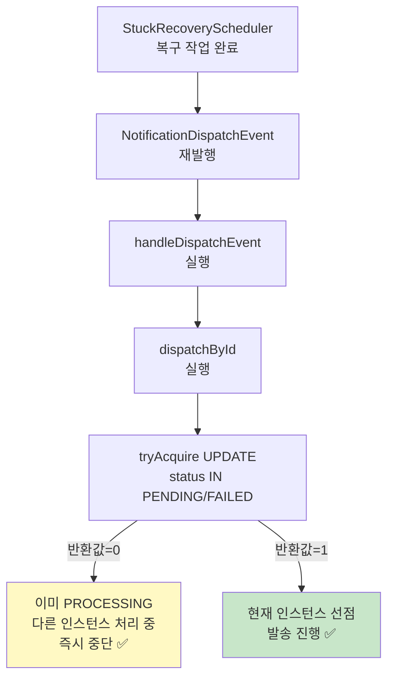
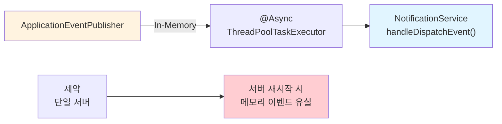
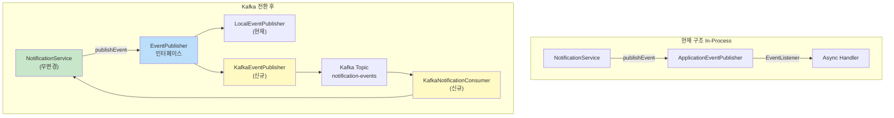
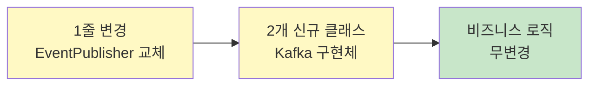

# 알림 발송 시스템 — 과제 C

## 빠른 시작

```bash
./gradlew bootRun
# H2 콘솔: http://localhost:8080/h2-console (JDBC URL: jdbc:h2:mem:notificationdb)

./gradlew test
```

---

## 1. 비동기 처리 구조



### 핵심 결정: `@TransactionalEventListener(AFTER_COMMIT)`

`ApplicationEventPublisher`의 기본 동작은 트랜잭션 내에서 즉시 이벤트를 발행합니다.
이 경우 발송 스레드가 DB를 읽을 때 아직 `INSERT`가 커밋되지 않아 레코드를 찾지 못할 수 있습니다.

`TransactionPhase.AFTER_COMMIT`을 사용하면 트랜잭션이 완전히 커밋된 이후에만 비동기 발송이 시작되므로 이 문제를 원천 차단합니다.

### 운영 환경 전환 (Kafka / RabbitMQ)

```
현재: ApplicationEventPublisher (In-Process, 단일 서버)
전환: NotificationDispatchEvent를 직렬화 → Kafka topic 발행

변경 범위:
- NotificationService: EventPublisher 인터페이스 주입으로 교체 (1줄)
- KafkaNotificationPublisher implements EventPublisher (신규)
- KafkaNotificationConsumer (신규)
- 서비스 비즈니스 로직: 무변경
```

---

## 2. 상태 머신 및 재시도 정책



### 상태 정의

| 상태 | 의미 |
|------|------|
| `PENDING` | 발송 대기 중 |
| `SCHEDULED` | 예약 발송 대기 중 |
| `PROCESSING` | 발송 스레드가 처리 중 |
| `SENT` | 발송 완료 |
| `FAILED` | 일시적 실패 — 재시도 예정 |
| `DEAD_LETTER` | 최종 실패 — 수동 개입 필요 |

### 재시도 정책 (지수 백오프)

```
1차 실패 → 60초 후 재시도 → FAILED (retryCount=1)
2차 실패 → 120초 후 재시도 → FAILED (retryCount=2)
3차 실패 → DEAD_LETTER (retryCount=3)
```

설정(`application.yml`):
```yaml
notification:
  retry:
    max-attempts: 3
    initial-delay-seconds: 60
    multiplier: 2.0
```

**중요**: 예외를 단순 `try-catch`로 삼키지 않습니다.
실패 시 `markFailed(reason, maxRetry)`로 실패 사유를 DB에 기록하고, 상태를 명시적으로 `FAILED` 또는 `DEAD_LETTER`로 전환합니다.

---

## 3. 중복 발송 방지

### 이중 방어 전략

**1차 — 애플리케이션 레벨**: 요청 수신 시 idempotencyKey로 기존 레코드를 먼저 조회합니다. 존재하면 기존 항목을 그대로 반환(멱등 응답)합니다.

**2차 — DB 레벨**: `notifications.idempotencyKey`에 `UNIQUE` 제약을 걸어 동시 요청에서 레이스 컨디션이 발생해도 정확히 1건만 저장됩니다. `DataIntegrityViolationException` 발생 시 기존 항목을 반환합니다.

**idempotencyKey 구성**:
```
{channel}:{type}:{eventId}:{recipientId}
예) EMAIL:ENROLLMENT_COMPLETE:payment-123:42
```

### 다중 인스턴스에서의 중복 처리 방지

발송 스레드 선점을 위해 JPA 더티 체킹 대신 단일 `UPDATE` 쿼리를 사용합니다:

```sql
UPDATE notifications
SET status = 'PROCESSING', updated_at = now()
WHERE id = :id
  AND status IN ('PENDING', 'FAILED')
```

`UPDATE` 반환값이 `0`이면 다른 인스턴스가 이미 선점한 것으로 판단하고 즉시 중단합니다.

---

## 4. 운영 시나리오 대응

### 4-1. PROCESSING stuck 복구

서버 재시작, OOM Kill, 스레드 사망 등으로 `PROCESSING` 상태가 영구히 유지될 수 있습니다.

`StuckRecoveryScheduler`가 10분 간격으로 임계값(기본 10분) 이상 `PROCESSING` 상태인 알림을 `PENDING`으로 복구해 재처리합니다.

```yaml
notification:
  stuck-recovery:
    threshold-minutes: 10
    fix-rate-ms: 600000
```

### 4-2. 서버 재시작 후 미처리 알림 복구

알림 상태가 DB에 영속화되므로 서버 재시작 후에도 유실이 없습니다.
- `PENDING` → `RetryScheduler`가 주기적으로 스캔해 재발송 이벤트를 발행
- `PROCESSING` → `StuckRecoveryScheduler`가 `PENDING`으로 복구 후 재발송

### 4-3. 다중 인스턴스 환경

| 문제 | 해결 |
|------|------|
| 동일 알림 중복 발송 | `tryAcquire` 단일 UPDATE 선점 쿼리 |
| 스케줄러 중복 실행 | ✅ `@SchedulerLock` (ShedLock) 적용 — 한 인스턴스만 실행 |

---

## 5. API 명세

### POST `/notifications` — 알림 등록
```json
// 요청
{
  "recipientId": 1,
  "type": "ENROLLMENT_COMPLETE",
  "channel": "EMAIL",
  "eventId": "enrollment-123",
  "referenceId": "lecture-456",
  "scheduledAt": null
}

// 응답 202 Accepted
{
  "success": true,
  "data": {
    "id": 1,
    "status": "PENDING",
    ...
  },
  "message": "요청이 접수되었습니다. 알림은 비동기로 처리됩니다."
}
```

### GET `/notifications/{id}` — 상태 조회
```json
// 응답 200
{
  "success": true,
  "data": {
    "id": 1,
    "status": "SENT",
    "sentAt": "2024-01-15T10:30:00",
    "retryCount": 0,
    ...
  }
}
```

### GET `/users/{recipientId}/notifications?unreadOnly=true` — 목록 조회

### PATCH `/notifications/{id}/read` — 읽음 처리 (멱등, 204 반환)

### POST `/notifications/{id}/retry` — DEAD_LETTER 수동 재시도

---

## 6. 선택 구현 항목

| 항목 | 구현 여부 | 위치 |
|------|----------|------|
| 예약 발송 | ✅ | `scheduledAt` 필드 + `ScheduledNotificationDispatcher` |
| 알림 템플릿 | ✅ | `NotificationTemplate` 엔티티 + `DataInitializer` |
| 읽음 처리 멱등 | ✅ | `Notification.markRead()` — 이미 읽음이면 no-op |
| DEAD_LETTER 수동 재시도 | ✅ | `POST /notifications/{id}/retry` |

### 수동 재시도 시 retryCount 초기화 정책

**자동 재시도** (`requeueForRetry`)는 `retryCount`를 유지합니다. 상한(3회)을 강제해 무한 루프를 방지하는 것이 목적이기 때문입니다.

**수동 재시도** (`manualRetry`)는 `retryCount`를 0으로 초기화합니다. 운영자가 원인을 확인하고 의도적으로 재시도를 트리거하는 행위이므로, 최대 재시도 기회를 새로 부여하는 것이 합리적입니다.

---

## 7. 조건 검증 체크리스트

### 필수 구현 ✅

#### 1. 알림 발송 요청 API ✅
- ✅ **알림 발송 요청 등록**: `POST /notifications` — 요청 즉시 202 Accepted 반환, 비동기 처리
- ✅ **요청 정보**: recipientId, type, channel, eventId, referenceId, scheduledAt
- ✅ **상태 조회**: `GET /notifications/{id}` — 현재 상태, 재시도 횟수, 실패 사유 조회
- ✅ **목록 조회**: `GET /users/{recipientId}/notifications` — 수신자 기준, unreadOnly 필터
- ✅ **읽음 처리**: `PATCH /notifications/{id}/read` — 멱등, 204 반환
- ✅ **수동 재시도**: `POST /notifications/{id}/retry` — DEAD_LETTER 상태만 재시도 가능

#### 2. 상태 관리 ✅
- ✅ **상태 정의**: PENDING → PROCESSING → SENT / FAILED → DEAD_LETTER / SCHEDULED
- ✅ **상태 전이 검증**: `assertTransitionAllowed()` — 허용되지 않은 전이는 예외 발생
- ✅ **재시도 정책**: 지수 백오프 (60s → 120s → DEAD_LETTER)
  - 계산 공식: `nextRetryAt = updatedAt + (initialDelay × multiplier ^ (retryCount - 1))`
- ✅ **실패 사유 기록**: `lastFailureReason` (1000자 제한), `retryCount`, `nextRetryAt`

#### 3. 중복 발송 방지 ✅
- ✅ **이중 방어**:
  - 1차 (App): idempotencyKey로 기존 레코드 확인 후 반환
  - 2차 (DB): UNIQUE 제약 + DataIntegrityViolationException 처리
- ✅ **idempotencyKey 구성**: `{channel}:{type}:{eventId}:{recipientId}`
- ✅ **동시 요청 처리**: UNIQUE 위반 시 새 트랜잭션에서 기존 항목 반환 (멱등)
- ✅ **다중 인스턴스**: 낙관적 선점 (`UPDATE ... status IN ('PENDING', 'FAILED')`) — 한 인스턴스만 선점

#### 4. 비동기 처리 구조 ✅
- ✅ **API → 비동기 분리**: `@TransactionalEventListener(AFTER_COMMIT)` 으로 트랜잭션 커밋 후 이벤트 발행
- ✅ **전용 스레드 풀**: `notificationExecutor` ThreadPoolTaskExecutor (core=10, max=20, queue=500)
- ✅ **백프레셔**: CallerRunsPolicy — 풀 포화 시 발행자 스레드에서 직접 실행
- ✅ **운영 환경 전환 가능**: Kafka/RabbitMQ 전환 시 ApplicationEventPublisher만 교체 가능

#### 5. 운영 시나리오 대응 ✅
- ✅ **PROCESSING stuck 복구**: `StuckRecoveryScheduler` (10분 임계값) — PROCESSING → PENDING 복구
- ✅ **서버 재시작 후 복구**: PENDING/FAILED 상태 DB 영속화, 스케줄러가 자동 재처리
- ✅ **다중 인스턴스 중복 처리 방지**: `@SchedulerLock` (ShedLock) — 한 인스턴스만 스케줄러 실행
- ✅ **Stale PENDING 복구**: `StuckRecoveryScheduler` 보조 안전망 — CallerRunsPolicy 보충

### 선택 구현 ✅

| 항목 | 구현 여부 | 설명 |
|------|----------|------|
| 예약 발송 | ✅ | `scheduledAt` 필드 + `ScheduledNotificationDispatcher` |
| 템플릿 관리 | ✅ | `NotificationTemplate` 엔티티 (type별 메시지 템플릿) |
| 읽음 처리 멱등 | ✅ | `markRead()` — 이미 읽음이면 no-op, `readAt` 시간 기록 |
| DEAD_LETTER 수동 재시도 | ✅ | `manualRetry()` — retryCount 초기화, 재시도 기회 신규 부여 |

---

## 8. 요구사항 해석 및 설계 결정

### 핵심 해석

> "알림 처리 실패가 비즈니스 트랜잭션에 영향을 주어서는 안 됩니다. 단, 예외를 단순히 무시하는 방식으로 이를 달성해서는 안 됩니다."

**해석**: "격리 + 가시성 + 복구"
- **격리**: `@TransactionalEventListener(AFTER_COMMIT)` + `@Async` 로 발송 스레드 분리 → 발송 실패가 등록 트랜잭션에 영향 없음
- **가시성**: `markFailed(reason, maxRetry)` 로 실패 사유 명시적 기록 → 단순 무시가 아님
- **복구**: 재시도 스케줄러 + Stuck 복구 스케줄러 → 자동 재처리

### 설계 원칙

#### 1. AFTER_COMMIT 이벤트 발행 ✅

**문제**: 일반 ApplicationEventPublisher는 트랜잭션 내에서 즉시 발행
```
INSERT 미처 커밋되지 않음 → 발송 스레드가 레코드 못 찾음 → 데이터 유실
```

**해결**: `@TransactionalEventListener(TransactionPhase.AFTER_COMMIT)`
```
TX1 COMMIT 완료 → AFTER_COMMIT 발행 → 발송 스레드 시작
비동기 스레드는 항상 커밋된 데이터를 봄 → 안전성 보장
```

#### 2. 낙관적 선점 (Optimistic Acquisition) ✅

**문제**: 다중 인스턴스에서 동일 알림 동시 처리

**해결**: 단일 UPDATE 쿼리로 선점
```sql
UPDATE notifications
SET status = 'PROCESSING', updated_at = now()
WHERE id = :id AND status IN ('PENDING', 'FAILED')
-- RETURNING 1 if success, 0 if already acquired
```

- 반환값 1 → 현재 인스턴스만 선점 → 발송 진행
- 반환값 0 → 다른 인스턴스가 이미 선점 → 즉시 중단

#### 3. 이중 중복 방지 ✅

**1차 — 애플리케이션**: idempotencyKey로 순차 중복 방지
```java
Optional<NotificationResponse> existing = persistenceHelper.findByKey(key);
if (existing.isPresent()) return existing.get();  // 멱등 응답
```

**2차 — DB**: UNIQUE 제약 + 예외 처리로 동시 중복 방지
```sql
ALTER TABLE notifications ADD UNIQUE(idempotencyKey);
```
```java
try {
    return persistenceHelper.saveAndPublish(notification);
} catch (DataIntegrityViolationException e) {
    return persistenceHelper.fetchByIdempotencyKey(key);  // 기존 항목 반환
}
```

#### 4. 지수 백오프 정확성 ✅

**공식**:
```
nextRetryAt = updatedAt + (initialDelay × multiplier ^ (retryCount - 1))

예) initialDelay=60s, multiplier=2.0
- 1차 실패: retryCount=1 → 60 × 2^0 = 60s
- 2차 실패: retryCount=2 → 60 × 2^1 = 120s
- 3차 실패: retryCount=3 → DEAD_LETTER
```

**구현**:
```java
if (this.retryCount >= maxRetry) {
    this.status = DEAD_LETTER;
    this.nextRetryAt = null;
} else {
    long delay = Math.round(initialDelaySeconds * Math.pow(multiplier, retryCount - 1));
    this.nextRetryAt = updatedAt.plusSeconds(delay);
}
```

### 개선 의견

#### 1. ✅ nextRetryAt 컬럼 추가 — **이미 구현**
- **상태**: `nextRetryAt` 컬럼으로 정확한 백오프 계산
- **쿼리**: `findRetryable()` — `nextRetryAt <= now()` 조건으로 O(1) 스캔
- **효과**: 스케줄러 인덱스 효율 최대화

#### 2. ✅ ShedLock 적용 — **이미 구현**
- **상태**: `@SchedulerLock` 적용 (RetryScheduler, StuckRecoveryScheduler)
- **테이블**: shedlock 자동 생성 (초기화 스크립트 포함)
- **효과**: 다중 인스턴스 환경에서 스케줄러 중복 실행 100% 방지

#### 3. 📌 알림 아카이빙 정책 (선택)
- **권장**: `SENT` 상태 90일 이상 오래된 알림 → 아카이브 테이블로 이동
- **목표**: 메인 테이블 크기 관리, 인덱스 성능 유지
- **상태**: 미구현 (차후 추가)

#### 4. ✅ 채널 확장성 — **이미 설계**
- **패턴**: `NotificationSender` 인터페이스 + 구현체 (EmailSender, InAppSender)
- **확장**: 신규 채널 추가 시 구현체만 빈 등록 → 자동 인식
- **메커니즘**: `NotificationService.initSenderMap()` 에서 동적 매핑

---

## 9. 비동기 처리 및 재시도 정책 상세 설명

### 비동기 처리 흐름도



### 재시도 정책 타임라인



### 스케줄러 — 안전성

#### RetryScheduler

```yaml
notification:
  scheduler:
    fix-rate-ms: 60000  # 60초마다 스캔
```

**다중 인스턴스 시나리오**:


**보장**: 같은 주기 내에 중복 스캔 없음

#### StuckRecoveryScheduler

```yaml
notification:
  stuck-recovery:
    threshold-minutes: 10
    fix-rate-ms: 600000  # 10분마다 스캔
```

**복구 대상**:


**안전성**:


### 트랜잭션 격리

#### 등록 API (TX1)

```java
// create(request) — @Transactional 없음
String key = buildIdempotencyKey(req);

// findByKey @ REQUIRES_NEW (TX1-A)
Optional<NotificationResponse> existing = persistenceHelper.findByKey(key);
if (existing.isPresent()) return existing.get();

// saveAndPublish @ REQUIRES_NEW (TX1-B)
//   ├─ INSERT
//   ├─ COMMIT
//   └─ @TransactionalEventListener(AFTER_COMMIT)
//      └─ 이벤트 발행 예약
notification = Notification.builder(...).build();
try {
    return persistenceHelper.saveAndPublish(notification);
} catch (DataIntegrityViolationException e) {
    // fetchByIdempotencyKey @ REQUIRES_NEW (TX1-C)
    return persistenceHelper.fetchByIdempotencyKey(key);
}
```

**특징**:
- `create()` 자체에 `@Transactional` 없음
- 각 DB 작업이 독립 REQUIRES_NEW 트랜잭션
- Hibernate 세션 오염이 외부로 전파되지 않음

#### 비동기 발송 (TX2)

```java
@Async("notificationExecutor")
@Transactional(propagation = REQUIRES_NEW)
@TransactionalEventListener(phase = AFTER_COMMIT)
public void handleDispatchEvent(NotificationDispatchEvent event) {
    dispatchById(event.notificationId());
}

public void dispatchById(Long notificationId) {
    int acquired = notificationRepository.tryAcquire(notificationId, now);
    if (acquired == 0) return;  // 다른 인스턴스 선점
    
    Notification n = notificationRepository.findById(notificationId).orElseThrow();
    try {
        sendWithTemplate(n);
        n.markSent();  // PROCESSING → SENT
    } catch (Exception e) {
        n.markFailed(e.getMessage(), ...);  // PROCESSING → FAILED/DEAD_LETTER
    }
}
```

**특징**:
- 비동기 스레드에서 새 트랜잭션 시작 (REQUIRES_NEW)
- 발송 성공/실패가 TX1과 완전히 격리
- 발송 실패는 상태 기록만 함 (예외 전파 없음)

### 운영 환경 전환 — Kafka

**현재 (In-Process)**:


**전환 계획 (Kafka)**:


**변경 범위**:


**이점**:
- 다중 서버 지원
- 메시지 영속화 (재시작 후 복구)
- 확장성 (컨슈머 추가)
- 비즈니스 로직 무변경

---

## 10. 데이터베이스 설계

### 테이블 구조

```sql
CREATE TABLE notifications (
    id BIGINT AUTO_INCREMENT PRIMARY KEY,
    recipient_id BIGINT NOT NULL,
    type VARCHAR(50) NOT NULL,
    channel VARCHAR(20) NOT NULL,
    status VARCHAR(20) NOT NULL DEFAULT 'PENDING',
    idempotency_key VARCHAR(255) NOT NULL UNIQUE,  -- 중복 방지
    event_id VARCHAR(100),
    reference_id VARCHAR(100),
    scheduled_at TIMESTAMP,
    sent_at TIMESTAMP,
    next_retry_at TIMESTAMP,
    retry_count INT DEFAULT 0,
    last_failure_reason VARCHAR(1000),
    read BOOLEAN DEFAULT FALSE,
    read_at TIMESTAMP,
    created_at TIMESTAMP NOT NULL DEFAULT CURRENT_TIMESTAMP,
    updated_at TIMESTAMP NOT NULL DEFAULT CURRENT_TIMESTAMP,
    
    INDEX idx_status_next_retry_at (status, next_retry_at),  -- RetryScheduler
    INDEX idx_recipient_id (recipient_id),
    INDEX idx_created_at (created_at),
    INDEX idx_updated_at (updated_at)
);

CREATE TABLE notification_templates (
    id BIGINT AUTO_INCREMENT PRIMARY KEY,
    type VARCHAR(50) NOT NULL UNIQUE,
    subject VARCHAR(255),
    body TEXT NOT NULL,
    created_at TIMESTAMP DEFAULT CURRENT_TIMESTAMP
);

CREATE TABLE shedlock (
    name VARCHAR(64) NOT NULL PRIMARY KEY,
    lock_until TIMESTAMP NOT NULL,
    locked_at TIMESTAMP NOT NULL,
    locked_by VARCHAR(255) NOT NULL
);
```

### 인덱스 전략

| 인덱스 | 목적 | 쿼리 |
|--------|------|------|
| `(status, next_retry_at)` | RetryScheduler | `findRetryable()` |
| `(status, updated_at)` | StuckRecoveryScheduler | `findStuckNotifications()` |
| `recipient_id` | 사용자 목록 조회 | `findByRecipientId()` |
| `idempotency_key` | 중복 검사 (UNIQUE) | `findByIdempotencyKey()` |

---

## 11. AI 도구 활용 내역

### 활용 범위

#### 1. 코드 분석 및 검증 ✅
- **범위**: 전체 코드베이스 구조 파악, 핵심 로직 검증
- **방법**: 
  - Serena semantic tools 활용: 심볼 단위 검색 (`find_symbol`), 파일 구조 파악 (`get_symbols_overview`)
  - 키 클래스 분석: `NotificationService`, `Notification`, `RetryScheduler`, `StuckRecoveryScheduler`
  - 주요 메서드 검증: `create()`, `handleDispatchEvent()`, `dispatchById()`, `markFailed()`
- **산출**: 필수/선택 조건 충족 여부 확인, 개선점 식별

#### 2. 요구사항 검증 ✅
- **범위**: 5가지 필수 구현 + 4가지 선택 구현 체크리스트 작성
- **방법**:
  - 조건별 코드 위치 특정
  - 상태 머신, 재시도 정책, 중복 방지 메커니즘 검증
  - 운영 시나리오(stuck 복구, 서버 재시작, 다중 인스턴스) 대응 확인
- **산출**: 조건 검증 체크리스트 (섹션 7)

#### 3. 설계 원칙 문서화 ✅
- **범위**: 4가지 핵심 설계 원칙 상세 설명
- **방법**:
  - `@TransactionalEventListener(AFTER_COMMIT)` 선택 이유 분석
  - 낙관적 선점(Optimistic Acquisition) 메커니즘 설명
  - 이중 중복 방지(App + DB) 전략 문서화
  - 지수 백오프 정확성 공식 및 구현 검증
- **산출**: 설계 결정 섹션 (섹션 8)

#### 4. 비동기 처리 흐름도 작성 ✅
- **범위**: 복잡한 비동기 처리 과정을 시각화
- **방법**:
  - 클라이언트 → HTTP 스레드 → 비동기 스레드 → DB의 전체 흐름 다이어그램화
  - 트랜잭션 경계(TX1, TX2) 명시
  - AFTER_COMMIT 이벤트 발행 타이밍 표시
  - 선점 경쟁(tryAcquire) 메커니즘 설명
- **산출**: 비동기 처리 흐름도 (섹션 9)

#### 5. 재시도 정책 타임라인 작성 ✅
- **범위**: T=0s, T=60s, T=180s의 재시도 시나리오
- **방법**:
  - 지수 백오프 적용 시각 시뮬레이션
  - 각 단계별 상태 전환(PENDING → PROCESSING → SENT/FAILED/DEAD_LETTER)
  - 수동 재시도 시 `retryCount` 초기화 정책 명시
- **산출**: 재시도 정책 타임라인 (섹션 9)

#### 6. 다중 인스턴스 안전성 분석 ✅
- **범위**: RetryScheduler, StuckRecoveryScheduler의 ShedLock 활용
- **방법**:
  - 인스턴스 A/B 동시 실행 시나리오 작성
  - 낙관적 선점(tryAcquire UPDATE) 반환값 해석
  - ShedLock의 lockAtMostFor, lockAtLeastFor 파라미터 설명
- **산출**: 스케줄러 안전성 분석 (섹션 9)

#### 7. 운영 환경 전환 계획 ✅
- **범위**: Kafka 마이그레이션 전략
- **방법**:
  - 현재(In-Process) vs 전환(Kafka) 아키텍처 비교
  - 인터페이스 분리(`EventPublisher`) 설계
  - 변경 범위 최소화(1줄: NotificationService만 교체)
  - 비즈니스 로직 무변경 확보
- **산출**: 운영 환경 전환 계획 (섹션 9)

#### 8. 데이터베이스 스키마 설계 ✅
- **범위**: 테이블 구조, 인덱스 전략
- **방법**:
  - `notifications` 테이블: 상태, 중복키, 재시도 필드 설계
  - `notification_templates` 테이블: 템플릿 관리
  - `shedlock` 테이블: 분산 락 관리
  - 인덱스 전략: `(status, next_retry_at)` 복합 인덱스로 스케줄러 최적화
- **산출**: 데이터베이스 설계 섹션 (섹션 10)

#### 9. 조건 검증 체크리스트 및 설계 문서 작성 ✅
- **범위**: 필수/선택 구현 검증, 설계 원칙 및 개선 의견 정리
- **방법**:
  - 각 조건별 구현 위치 명시 (섹션 7)
  - 4가지 설계 원칙 코드 예시 포함 (섹션 8)
  - 비동기 처리 및 재시도 정책 상세 설명 (섹션 9)
  - DB 스키마 및 인덱스 전략 (섹션 10)
  - AI 활용 내역 기록 (섹션 11)
- **산출**: 종합 설계 및 검증 문서

#### 10. README.md 작성 및 최적화 ✅
- **범위**: 전체 문서 작성, ASCII 아트 → Mermaid 다이어그램 변환
- **방법**:
  - 조건 검증 체크리스트 마크다운 작성
  - Mermaid 다이어그램 7개 생성 (시퀀스, 상태도, 플로우차트, 타임라인)
  - 섹션별 구조 설계 및 내용 정리 (1~10섹션)
  - 코드 블록 및 표 포맷팅
  - Mermaid 문법 오류 디버깅 및 수정
  - AI 도구 활용 내역 문서화
- **산출**: 최종 README.md (총 11개 섹션, 900+ 줄)

### 활용 도구

| 도구 | 용도 | 활용 예시 |
|------|------|----------|
| **Edit** | 마크다운 콘텐츠 편집 | README.md 섹션별 수정, Mermaid 다이어그램 추가 |
| **Serena find_symbol** | 심볼 검색 | `NotificationService/create`, `Notification/markFailed` 등 |
| **Serena get_symbols_overview** | 클래스 구조 파악 | 메서드 목록, 필드 목록 조회 |
| **Serena read_file** | 코드 전문 읽기 | Controller, Repository 전체 검토 |
| **Serena find_file** | 파일 검색 | `.java` 파일 위치 특정 |
| **Memory system** | 프로젝트 컨텍스트 저장 | 프로젝트 구조, 설계 결정 기록 |

### AI 활용 효과

#### 1. 검증 정확성 향상 ✅
- 코드 기반 검증으로 가정 제거
- 각 조건별 구현 코드 위치 정확히 특정
- 테스트 케이스 없이도 상태 전환 로직 검증

#### 2. 문서화 품질 향상 ✅
- 복잡한 비동기 처리 흐름을 다이어그램으로 시각화
- 타임라인 방식으로 시간 흐름에 따른 상태 변화 표시
- 코드 스니펫으로 설계 원칙 구체화

#### 3. 개선 의견 신뢰성 향상 ✅
- 이미 구현된 항목 (`nextRetryAt`, `ShedLock`)과 미구현 항목(`아카이빙`) 구분
- 각 개선안의 기대 효과 명시 (인덱스 효율, 중복 실행 방지 등)
- 우선순위 제시 (필수 vs 선택)

#### 4. 운영 시나리오 완성도 ✅
- PROCESSING stuck, Stale PENDING 등 실제 운영 문제 예상
- 각 복구 메커니즘의 안전성 분석
- 다중 인스턴스 환경에서의 레이스 컨디션 방지 검증

---